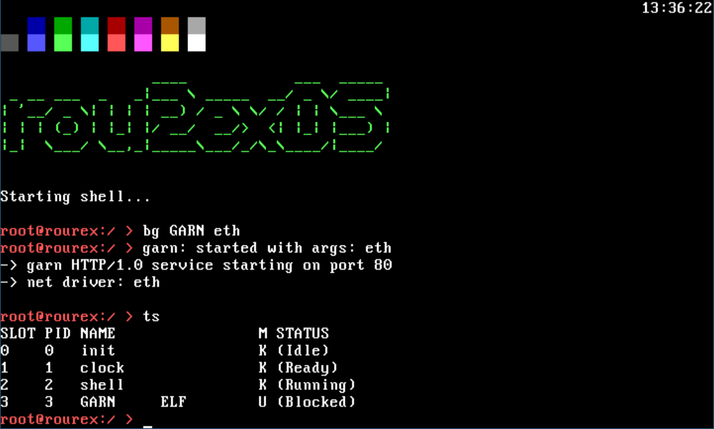

# rou2exOS Rusted Edition

A second iteration of the RoureXOS operating system, rewritten in Rust.

+ [Original RoureXOS (a blog post)](https://krusty.space/projects/rourexos/)
+ [rou2exOS Rusted Edition (a blog post)](https://blog.vxn.dev/rou2exos-rusted-edition)

The goal of this project is to make the rou2exOS kernel to follow the microkernel architecture. For purposes of the external program development, there are two key links to consider opening when thinking about extending the system:

+ [ABI specification document](/docs/ABI_OVERVIEW.md)
+ [Syscall client implementation examples](https://github.com/krustowski/rou2exOS-apps) (aka `rou2exOS` Apps)

To run the OS, you can use the attached ISO image from any [Release](https://github.com/krustowski/rou2exOS/releases), and run it in QEMU emulator. The system was also tested on the x86_64 baremetal (booted from the USB flash disk). To enable the filesystem functionalities, attach a IMG file to QEMU as well (in virtual floppy drive A).

```
qemu-system-x86_64 -boot d -cdrom r2.iso -fda fat.img
```

## Preview


^ __v0.10.2__: kernel init process output


^ __v0.10.4__: external executable output + clock process



^ __v0.10.8__: external program `GARN.ELF` (a combined HTTP/1.0 server and ICMP responder) and task listing in kernel shell


^ __v0.10.8__: external program `GFXTEST.ELF` to test the VGA/EGA capabilities in text mode

### Legacy


^__v0.10.1__: kernel init process output


## How to build and run from source

```shell
# install Rust and its dependencies
make init

# make sure you have `xorriso`, `net-tools` and `grub2-tools` (or just grub-tools) 
# installed (Linux)
dnf install xorriso net-tools grub2-tools qemu qemu-common qemu-system-x86 mtools lld

# compile the kernel and stage2 bootloader, link it into an ELF binary and bake into an ISO
# image with GRUB bootloader
make build

# run the QEMU emulation with ISO image
make run_iso

# create a floppy image and attach it to virtual machine (will enable filesystem-related features)
# please do note that the floppy image is overwritten every time you hit this target
make run_iso_floppy

# (alternative) run the kernel exclusively only (needs the `bootloader` dependency in 
# Cargo.toml to be added)
cargo bootimage
make run
```

## How to test ICMP/SLIP 

Start a virtual machine to receive the `pty` handle:

```log
make run_iso

char device redirected to /dev/pts/3 (label serial0)
```

Listen for SLIP packets and create a `sl0` interface:

```bash
sudo slattach -L -p slip -s 115200 /dev/pts/3
sudo ifconfig sl0 10.3.3.1 pointopoint 10.3.3.2 up
```

Catch packets using `tcpdump`:

```bash
sudo tcpdump -i sl0
```

Run the `response` command in the system shell to handle ICMP
```r2
response
```

Now you should be able to ping the machine from your machine
```bash
ping 10.3.3.2
```

## Hot to test ICMP/Ethernet

Prepare the "bridge" interface on host:

```bash
sudo ip tuntap add dev tap0 mode tap
sudo ip link set tap0 up
sudo ip addr add 10.3.4.1/24 dev tap0
```

Boot the kernel in text mode and run:

```bash
make build build_floppy run_iso_net
```

```r2
bg ETH debug
```

Verify it is running in scheduler (prolly will be Blocked, which is operational for the Ethernet driver):

```r2
ts
```

Test the connection from the host OS:

```bash
ping 10.3.4.2
```

## How to convert and import a font (graphics mode)

Download a font (ideally in PSF format), add the selected font file into `src/video/fonts` as `console.psf`.

To convert a font from BDF format use the `bdf2psf` utility (should be available in the Linux distro repos). We especially want to render the font to Framebuffer (`--fb` flag). An example command syntax is shown below.

```shell
bdf2psf --fb terminus-font-4.49.1/ter-u16b.bdf /usr/share/bdf2psf/standard.equivalents /usr/share/bdf2psf/ascii.set 256 console.psf
```

