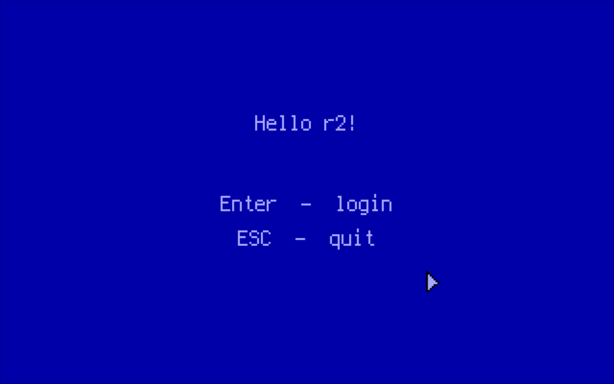
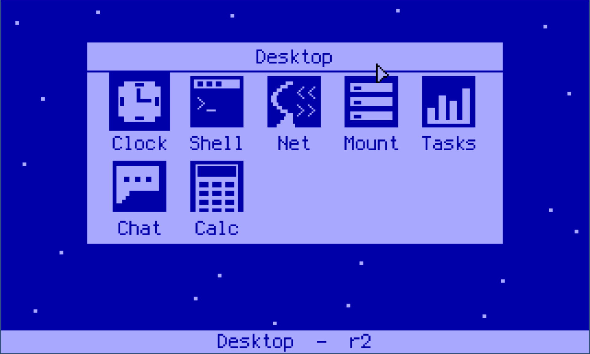
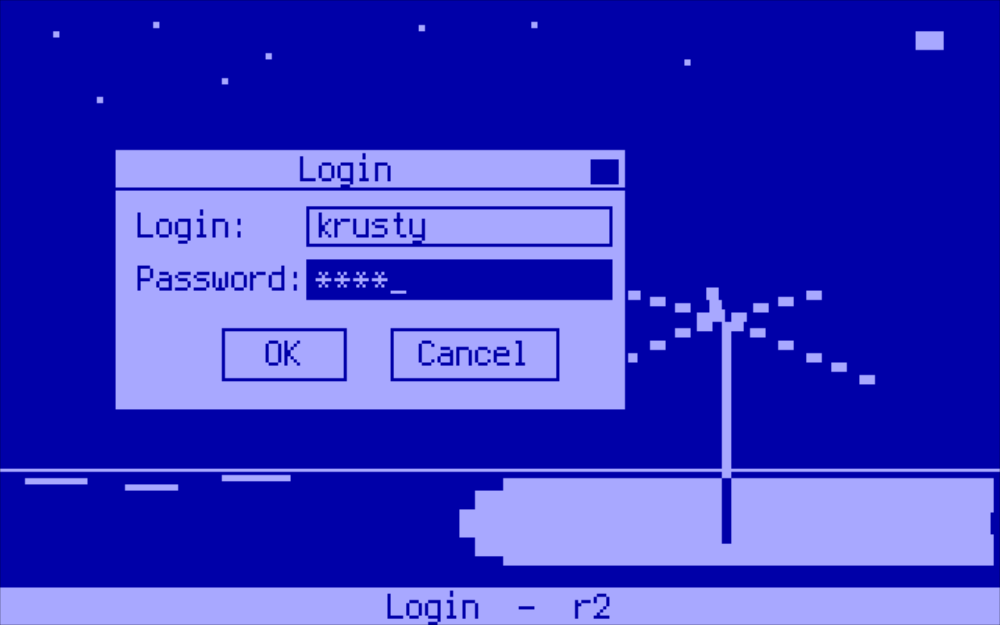

# Intro

 A second iteration of a DOS-inspired hobby OS. Written in Rust and x86 assembly. It boots, runs, executes, schedules, renders and does networking.

 Check it out on [Github](https://github.com/krustowski/rou2exOS)!



*Fig. 1: The initial screen of the `MEMENTO` GUI experiment. The screen is shown right after the boot (if configured in the init script so). That "thing" on the right is the mouse cursor ready to be moved by a PS/2 mouse.*



*Fig 2: The Desktop window showing a variety of some "programs" available to run in `MEMENTO`.*



*Fig. 3: External userspace program demo called `MEMENTO.ELF`. Login window in the foreground, a wallpaper in the background.*


*Fig. 4: The Clock window in the `MEMENTO` GUI experiment.*

Userland programs are flat ELF binaries loaded into a fixed region (`0x600_000–0xA00_000`) and call into the kernel via interrupt `0x7F`.


*Fig. 5: Kernel shell init. The verbose output is generated by just-started external applications. The `INIT.RC` script file is parsed and executed by the shell command interpreter.*

It boots via GRUB/Multiboot2, runs in 64-bit long mode with a custom identity-mapped page table, and exposes a kernel shell backed by a preemptive round-robin scheduler. 

The kernel speaks directly to the hardware: 

+ ISA DMA for floppy I/O (FAT12), 
+ ATAPI PIO for CD-ROM (ISO9660), 
+ an RTL8139 NIC for Ethernet/TCP networking, 
+ a VESA framebuffer or VGA text mode for output. 

## Releases

To run the latest release of the kernel (`r2.iso`) and the aux floppy image (`fat.img`), just visit link below and download both files to your machine.

+ [Releases on github.com](https://github.com/krustowski/rou2exOS/releases)

Please consult the [Build & Run](/build/) page to see options on how to run the system in QEMU locally.

```
qemu-system-x86_64 -boot d -cdrom r2.iso -fda fat.img
```

## Repositories

+ [rou2exOS kernel](https://github.com/krustowski/rou2exOS)
+ [r2apps](https://github.com/krustowski/r2apps)


## Blog posts

+ [Original RoureXOS project (krusty.space)](https://krusty.space/projects/rourexos/), June 6, 2024
+ [rou2eXOS Rusted Edition (blog.vxn.dev)](https://blog.vxn.dev/rou2exos-rusted-edition), May 30, 2025
+ [Show HN: A DOS-like hobby OS written in Rust and x86 assembly (news.ycombinator.com)](https://news.ycombinator.com/item?id=44318588), June 19, 2025
+ [rou2exOS: a DOS-like hobby operating system written in Rust (osnews.com)](https://www.osnews.com/story/142612/rou2exos-a-dos-like-hobby-operating-system-written-in-rust/), June 20, 2025
+ [Developer Creates Rust-Based DOS-Like Operating System with Modern Networking Stack (finance.biggo.com)](https://finance.biggo.com/news/202506201922_Rust_DOS-Like_OS), June 20, 2025
+ [rou2exOS - Rust와 x86 어셈블리어로 작성된 Dos-like 취미 OS (news.hada.io)](https://news.hada.io/topic?id=21622), June 24, 2025

---

*Note: Some portions of this documentation have been generated from the original source code by AI.*
