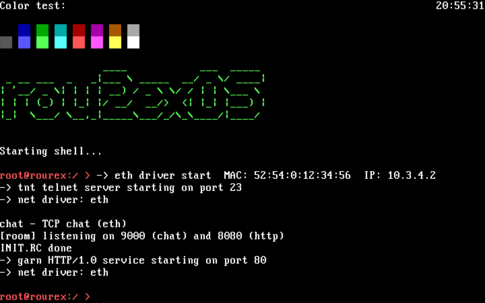

# Intro

 A second iteration of a DOS-inspired hobby OS. Written in Rust and x86 assembly. It boots, runs, executes, schedules, renders and does networking.

 Check it out on [Github](https://github.com/krustowski/rou2exOS)!


*Fig. 1: The initial screen of the `MEMENTO` GUI experiment. The screen is shown right after the boot (if configured in the init script so). That "thing" on the right is the mouse cursor ready to be moved by a PS/2 mouse.*


*Fig 2: The Desktop window showing a variety of some "programs" available to run in `MEMENTO`.*


*Fig. 3: External userspace program demo called `MEMENTO.ELF`. Login window in the foreground, a wallpaper in the background.*


*Fig. 4: The Clock window in the `MEMENTO` GUI experiment.*

Userland programs are static ELF64 binaries. Each one runs in ring 3 in its own private 2 MiB frame mapped at `0x600_000` and calls into the kernel via interrupt `0x7F`. Programs can be written in C, C++ or Go (TinyGo) using the libraries of the [SDK](sdk/index.md).



*Fig. 5: Kernel shell init. The verbose output is generated by just-started external applications. The `INIT.RC` script file is parsed and executed by the shell command interpreter.*

It boots via GRUB/Multiboot2, runs in 64-bit long mode with a custom identity-mapped page table, and exposes a kernel shell backed by a preemptive round-robin scheduler running at 1000 Hz. 

The kernel speaks directly to the hardware: 

+ ISA DMA for floppy I/O (FAT12, read/write, with a track cache), 
+ ATAPI PIO for CD-ROM (ISO9660, read-only; carries the shipped programs in `/bin`), 
+ an RTL8139 NIC for Ethernet/TCP networking, 
+ a VESA framebuffer or VGA text mode for output, plus VGA mode 13h for userland,
+ a PS/2 keyboard and mouse,
+ the PC speaker (tones and Standard MIDI Files). 

## Releases

To run the latest release of the kernel (`r2.iso`) and the aux floppy image (`fat.img`), just visit link below and download both files to your machine. The ISO carries the kernel and the userland programs; the floppy carries the startup script, configuration and data.

+ [Releases on github.com](https://github.com/krustowski/rou2exOS/releases)

Please consult the [Build & Run](build.md) page to see options on how to run the system in QEMU locally.

```
qemu-system-x86_64 -boot d -cdrom r2.iso -fda fat.img
```

## Repositories

+ [rou2exOS kernel](https://github.com/krustowski/rou2exOS) — this kernel and its documentation
+ [rou2exOS-apps](https://github.com/krustowski/rou2exOS-apps) — the SDK (`libcr2`, `libc++r2`, `libgor2`, `r2net`) and the [application suite](sdk/apps.md)

## Where to Start

| If you want to… | Read |
|-----------------|------|
| Run the system | [Build & Run](build.md) |
| Use the kernel shell | [Shell](shell.md) |
| Write a program for `r2` | [SDK Overview](sdk/index.md) |
| Call the kernel directly | [Syscall Specification](abi/syscall_specification.md) |
| Understand the kernel | [Boot / Init](init/overview.md), [Scheduler](multitasking/scheduler.md), [Memory](memory/overview.md) |


## Blog posts

+ [Original RoureXOS project (krusty.space)](https://krusty.space/projects/rourexos/), June 6, 2024
+ [rou2eXOS Rusted Edition (blog.vxn.dev)](https://blog.vxn.dev/rou2exos-rusted-edition), May 30, 2025
+ [Show HN: A DOS-like hobby OS written in Rust and x86 assembly (news.ycombinator.com)](https://news.ycombinator.com/item?id=44318588), June 19, 2025
+ [rou2exOS: a DOS-like hobby operating system written in Rust (osnews.com)](https://www.osnews.com/story/142612/rou2exos-a-dos-like-hobby-operating-system-written-in-rust/), June 20, 2025
+ [Developer Creates Rust-Based DOS-Like Operating System with Modern Networking Stack (finance.biggo.com)](https://finance.biggo.com/news/202506201922_Rust_DOS-Like_OS), June 20, 2025
+ [rou2exOS - Rust와 x86 어셈블리어로 작성된 Dos-like 취미 OS (news.hada.io)](https://news.hada.io/topic?id=21622), June 24, 2025

---

*Note: Some portions of this documentation have been generated from the original source code by AI.*
