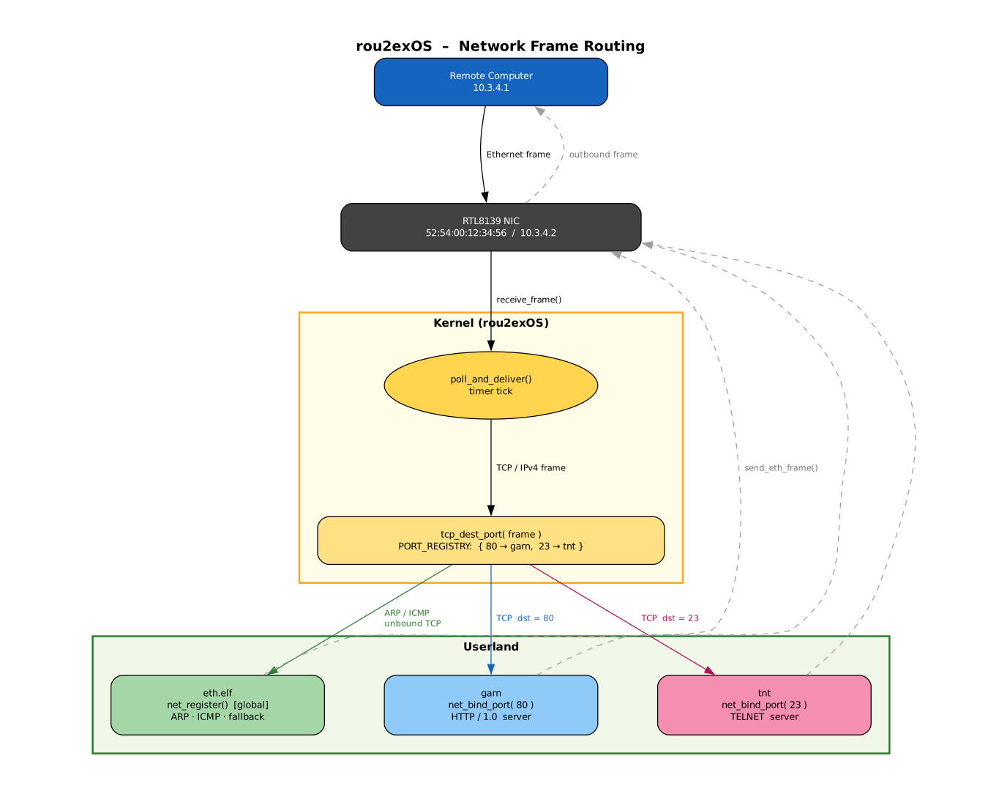

# Architecture Overview

## Stack Layers

```
  Userland process
       │  syscalls 0x33–0x37
       ▼
  ┌───────────────────────────────────────┐
  │  Syscall dispatcher (abi/syscall.rs)  │
  └───────────────┬───────────────────────┘
                  │
       ┌──────────▼──────────┐
       │   netdrv.rs         │  routing table, driver/port registry
       └──────────┬──────────┘
                  │                        ┌──────────┐
        ┌─────────▼──────────┐             │  serial  │
        │   rtl8139.rs       │  PCI NIC    │  + SLIP  │  UART path
        └─────────┬──────────┘             └──────────┘
                  │
        ┌─────────▼───────────────────────────────────────┐
        │  Protocol helpers (stateless, no global state)  │
        │   ethernet.rs  arp.rs  ipv4.rs                  │
        │   icmp.rs  tcp.rs  udp.rs                       │
        └─────────────────────────────────────────────────┘
```

There are two independent paths:

| Path | Hardware | Protocol | Direction |
|------|----------|----------|-----------|
| **Ethernet** | RTL8139 PCI NIC | Ethernet II → IPv4/ARP | TX and RX |
| **Serial/SLIP** | UART COM1 | SLIP-framed IPv4 | TX only (active), RX (loop-based) |



---

## Receive Path (Ethernet)

Frames arrive via polling, not IRQ. On every PIT tick (1000 Hz) the scheduler calls `netdrv::poll_and_deliver()` before selecting the next runnable process:

```
PIT tick
  → scheduler_schedule()
    → netdrv::poll_and_deliver()
      → rtl8139::peek_frame()             the frame at the front of the RX ring, left there
      → tcp_dest_port() / lookup_port()   whose it is: a bound service, else the driver
      → a free FRAME_BUF slot             the frame is copied into a buffer of its own
      → scheduler::try_push_msg(pid, msg) queued, and the target woken
      → rtl8139::consume_frame()          only now taken off the ring
    (repeated for up to 16 frames a tick)
```

Each queued frame has a 2 KiB buffer of its own, one of the 64 in `FRAME_BUF`, held for the receiving process until it copies the frame out with syscall `0x35`, which then frees it (so does the process's death, `release_frames_of`). The `Message` carries the buffer's address in `buf_addr` and the frame length in `port_id`. Up to 16 frames are delivered per tick.

A frame that cannot be queued --- no free buffer, the receiver's 64-message queue full, the scheduler locked by the syscall the tick interrupted --- stays at the front of the NIC's ring and is tried again next tick, so nothing is lost between the NIC and the receiver: when anything is dropped, it is by the NIC, once its own ring is full. A frame whose receiver takes nothing for 200 ticks is dropped, so that one process that has stopped reading cannot hold up the traffic for the others. `NETDRV_COUNTERS` counts delivered, held-back and dropped frames and the NIC's missed-packet counter.

Until v0.11 there was one shared 2 KiB buffer, `NET_FRAME_BUF`, and one frame per tick: the next frame overwrote the last whether or not it had been read, so a receiver that was busy for a few milliseconds lost every frame of a burst but the last, and TCP receivers had to keep their windows to a segment or two. Memento's browser took over two minutes for a 700 KiB page on QEMU's user networking; it now receives it in under a tenth of a second.

## Transmit Path (Ethernet)

Userland calls syscall `0x34` with arg1 `0x04` (raw Ethernet) or `0x01` (IPv4):

```
syscall 0x34
  → derive frame length from EtherType / IP total_length field
  → rtl8139::send_frame(data, len)
    → copy into TX_BUFFERS[TX_INDEX]
    → write physical buffer address to TxAddr register
    → write send_len to TxStatus register
    → advance TX_INDEX (round-robin over 4 TX descriptors)
```

Minimum Ethernet frame size (60 bytes) is enforced by zero-padding in `send_frame`.

## Transmit Path (Serial/SLIP)

Userland calls `ipv4::send_packet`, which:

1. SLIP-encodes the IPv4 datagram (`slip::encode`).
2. Sends each encoded byte through the UART via `serial::write`.

This path is legacy/fallback; the RTL8139 path is preferred for QEMU guests.

## Same-Host Loopback

When `ipv4::send_packet` detects `src_ip == dst_ip` (same-guest delivery) it calls `netdrv::loopback_deliver` instead of going through the NIC. This copies the frame into a `FRAME_BUF` slot and pushes it to the target process's message queue directly (a frame that cannot be queued is lost, as there is no ring to leave it in), bypassing the serial encoder and the NIC TX/RX cycle.

---

## Driver and Port Registry

`netdrv.rs` maintains two static tables (no `Mutex` — both are written only at init time and read under the PIT tick):

| Table | Size | Contents |
|-------|------|----------|
| `NET_DRV_PID` | 1 entry | PID of the global Ethernet driver (ARP, ICMP, unbound TCP) |
| `PORT_REGISTRY` | 16 entries | `(tcp_dest_port, pid)` for TCP port-specific services |

### Registration (syscall `0x37`)

- `arg1 = 0`: register as global driver. Initialises the RTL8139, reads and caches the MAC address in `SYSTEM_CONFIG`. Idempotent — no-op if a driver is already registered.
- `arg1 = N > 0`: bind TCP destination port `N` to the calling process. If an entry for that port already exists it is updated (to support restart/handover). If the table is full, slot 0 is overwritten.

### Frame Routing

On each incoming frame `poll_and_deliver` calls `tcp_dest_port(frame)` to extract the TCP destination port (or `None` if not IPv4/TCP). It then calls `lookup_port(port)` against `PORT_REGISTRY`. If a match is found the frame goes to that service's PID; everything else (ARP, ICMP, unregistered ports) goes to `NET_DRV_PID`.

---

## Limits

| Resource | Value |
|----------|-------|
| RX ring buffer | 32 KiB (RCR RBLEN = 10) + 1500-byte overrun guard |
| TX descriptors | 4 (round-robin) |
| TX buffer per descriptor | 2 KiB |
| Queued-frame buffers (`FRAME_BUF`) | 64 x 2 KiB |
| Messages queued per process | 64 |
| Max port bindings | 16 |
| SLIP encode/decode buffer | 4 KiB |
| Serial baud rate | 38 400 (COM1, divisor 3) |
| Poll rate | 1000 Hz, up to 16 frames per PIT tick |
