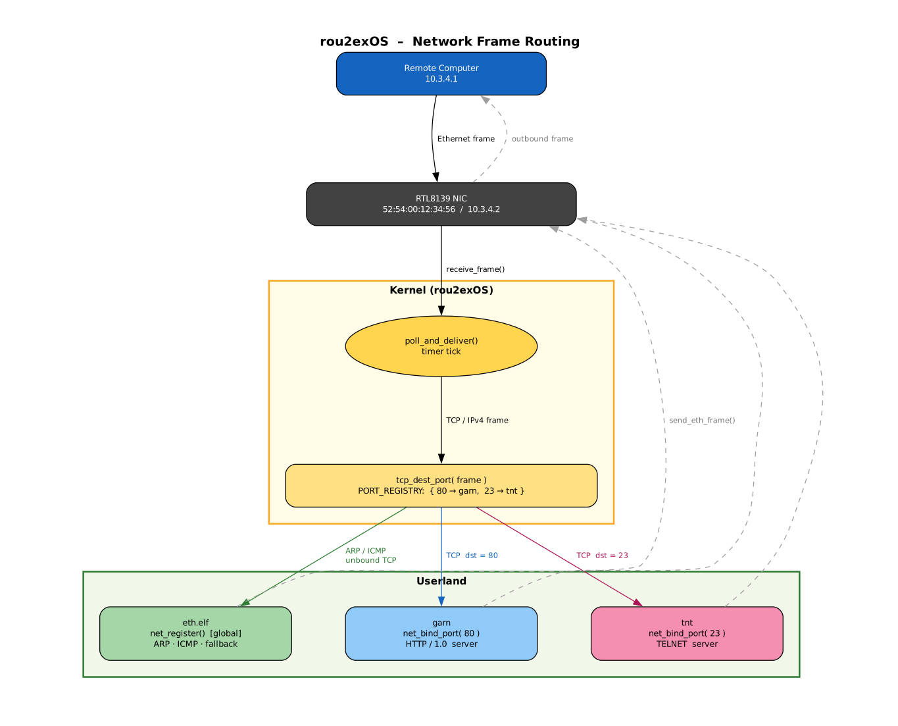

# Architecture Overview

## Stack Layers

```
  Userland process
       │  syscalls 0x33–0x37
       ▼
  ┌───────────────────────────────────────┐
  │  Syscall dispatcher (abi/syscall.rs)  │
  └───────────────┬───────────────────────┘
                  │
       ┌──────────▼──────────┐
       │   netdrv.rs         │  routing table, driver/port registry
       └──────────┬──────────┘
                  │                        ┌──────────┐
        ┌─────────▼──────────┐             │  serial  │
        │   nic.rs           │  RTL8139 / Intel PCI NIC    │  + SLIP  │  UART path
        └─────────┬──────────┘             └──────────┘
                  │
        ┌─────────▼───────────────────────────────────────┐
        │  Protocol helpers (stateless, no global state)  │
        │   ethernet.rs  arp.rs  ipv4.rs                  │
        │   icmp.rs  tcp.rs  udp.rs                       │
        └─────────────────────────────────────────────────┘
```

There are two independent paths:

| Path | Hardware | Protocol | Direction |
|------|----------|----------|-----------|
| **Ethernet** | RTL8139 or supported Intel PCI NIC | Ethernet II → IPv4/ARP | TX and RX |
| **Serial/SLIP** | UART COM1 | SLIP-framed IPv4 | TX only (active), RX (loop-based) |



---

## Receive Path (Ethernet)

Frames arrive via polling, not IRQ. On every PIT tick (1000 Hz) the scheduler calls `netdrv::poll_and_deliver()` before selecting the next runnable process:

```
PIT tick
  → scheduler_schedule()
    → netdrv::poll_and_deliver()
      → nic::peek_frame()             the frame at the front of the RX ring, left there
      → tcp_dest_port() / lookup_port()   whose it is: a bound service, else the driver
      → a free FRAME_BUF slot             the frame is copied into a buffer of its own
      → scheduler::try_push_msg(pid, msg) queued, and the target woken
      → nic::consume_frame()          only now taken off the ring
    (repeated for up to 16 frames a tick)
```

Each queued frame has a 2 KiB buffer of its own, one of the 64 in `FRAME_BUF`, held for the receiving process until it copies the frame out with syscall `0x35`, which then frees it (so does the process's death, `release_process`). The `Message` carries the buffer's address in `buf_addr` and the frame length in `port_id`. Up to 16 frames are delivered per tick.

A frame that cannot be queued --- no free buffer, the receiver's 64-message queue full, the scheduler locked by the syscall the tick interrupted --- stays at the front of the NIC's ring and is tried again next tick, so nothing is lost between the NIC and the receiver: when anything is dropped, it is by the NIC, once its own ring is full. A frame whose receiver takes nothing for 200 ticks is dropped, so that one process that has stopped reading cannot hold up the traffic for the others. `NETDRV_COUNTERS` counts delivered, held-back and dropped frames and the NIC's missed-packet counter.

Until v0.11 there was one shared 2 KiB buffer, `NET_FRAME_BUF`, and one frame per tick: the next frame overwrote the last whether or not it had been read, so a receiver that was busy for a few milliseconds lost every frame of a burst but the last, and TCP receivers had to keep their windows to a segment or two. Memento's browser took over two minutes for a 700 KiB page on QEMU's user networking; it now receives it in under a tenth of a second.

## Transmit Path (Ethernet)

Userland calls syscall `0x34` with arg1 `0x04` (raw Ethernet) or `0x01` (IPv4):

```
syscall 0x34
  → derive frame length from EtherType / IP total_length field
  → loopback::transmit(data, pid)   (frames for this machine stop here)
  → nic::send_frame(data, len)
    → selected RTL8139 or Intel backend
    (RTL8139 continues below)
    → copy into TX_BUFFERS[TX_INDEX]
    → write physical buffer address to TxAddr register
    → write send_len to TxStatus register
    → advance TX_INDEX (round-robin over 4 TX descriptors)
```

Minimum Ethernet frame size (60 bytes) is enforced by zero-padding in `send_frame`.

## Transmit Path (Serial/SLIP)

Userland calls `ipv4::send_packet`, which:

1. SLIP-encodes the IPv4 datagram (`slip::encode`).
2. Sends each encoded byte through the UART via `serial::write`.

This path is legacy/fallback; the RTL8139 path is preferred for QEMU guests.

## Loopback Device

A frame a process sends to this machine itself never reaches the NIC, which would not hear it anyway: `loopback.rs` takes it in syscall `0x34` and queues it to the process it is for, routed as frames off the NIC are (`netdrv::deliver`: by TCP destination port, else the global driver). So r2web, Memento or any other stack can reach GARN, TNT or Chat on the same machine, at `127.0.0.1` or at the address DHCP gave it.

| Sent | What happens |
|------|--------------|
| IPv4 to `127.0.0.0/8`, to the machine's address, or with `src == dst` | Queued locally, with the source MAC `00:00:00:00:00:00` (as Linux's `lo`) and the card's MAC as destination. |
| ICMP echo request to one of those | Answered by the kernel, to the sender. |
| ARP request for one of those (sender not `0.0.0.0`) | Answered by the kernel, to the asker, with the MAC `00:00:00:00:00:00`. Still sent out too, unless it is for `127.x`. |

The machine's address is the one in `SYSTEM_CONFIG` (set by the ETH driver through syscall `0x01`/`0x3D`); `SystemConfig::set_ip` keeps a lock-free copy for the loopback check.

The zero source MAC matters: the stacks drop frames from their own (the card's) MAC as echoes of their own broadcasts. With it they take a looped reply, learn that their own address is at `00:00:00:00:00:00`, and send there next time, which comes back through the loopback device because of the IP. A looped frame that cannot be queued (no free buffer, the receiver's queue full) is lost, as on a wire; TCP sends it again.

GARN and the other `libcr2` servers answer from the machine's address whatever address they were asked on, so a client must connect to that address for the replies to match: the browser stack (`web/net_r2.cpp`) resolves `localhost` to `127.0.0.1` and connects to its own address for anything in `127.0.0.0/8`.

---

## Driver and Port Registry

`netdrv.rs` maintains two static tables (no `Mutex` — updated during registration and process cleanup, and read during polling):

| Table | Size | Contents |
|-------|------|----------|
| `NET_DRV_PID` | 1 entry | PID of the global Ethernet driver (ARP, ICMP, unbound TCP) |
| `PORT_REGISTRY` | 16 entries | `(tcp_dest_port, pid)` for TCP port-specific services |

### Registration (syscall `0x37`)

- `arg1 = 0`: register as global driver. Probes RTL8139 first, then supported Intel controllers through `nic::init`, and reads and caches the MAC address in `SYSTEM_CONFIG`. Idempotent — no-op if a driver is already registered.
- `arg1 = N > 0`: bind TCP destination port `N` to the calling process. If an entry for that port already exists it is updated (to support restart/handover). If the table is full, slot 0 is overwritten.

Registrations last as long as the process. When it exits, is killed or crashes, `scheduler::kill`/`crash` call `netdrv::release_process(slot)`: the global driver slot is freed if the process held it, its port bindings are dropped, and so are the buffers of frames still queued to it. The next process to register becomes the driver; the NIC stays initialised. Until then, frames for bound ports are still delivered, and frames nobody is registered for are dropped.

### Frame Routing

On each incoming frame `poll_and_deliver` calls `tcp_dest_port(frame)` to extract the TCP destination port (or `None` if not IPv4/TCP). It then calls `lookup_port(port)` against `PORT_REGISTRY`. If a match is found the frame goes to that service's PID; everything else (ARP, ICMP, unregistered ports) goes to `NET_DRV_PID`.

ARP replies are the exception to one destination: besides the driver, every other process with a TCP port bound gets a copy (once per process, best effort: a copy that finds no free frame buffer is not made). Those processes run TCP/IP stacks of their own, like Memento's browser, video player and chat, and ARP for hosts on the local network themselves. Without the copy they could reach the gateway, whose MAC the driver publishes (syscall `0x3d`), but never a machine beside them on the LAN.

---

## Limits

| Resource | Value |
|----------|-------|
| RTL8139 RX ring buffer | 32 KiB (RCR RBLEN = 10) + 1500-byte overrun guard |
| RTL8139 TX descriptors | 4 (round-robin) |
| Intel RX / TX descriptors | 32 / 64 (2 KiB buffers) |
| TX buffer per descriptor | 2 KiB |
| Queued-frame buffers (`FRAME_BUF`) | 64 x 2 KiB |
| Messages queued per process | 64 |
| Max port bindings | 16 |
| SLIP encode/decode buffer | 4 KiB |
| Serial baud rate | 38 400 (COM1, divisor 3) |
| Poll rate | 1000 Hz, up to 16 frames per PIT tick |
