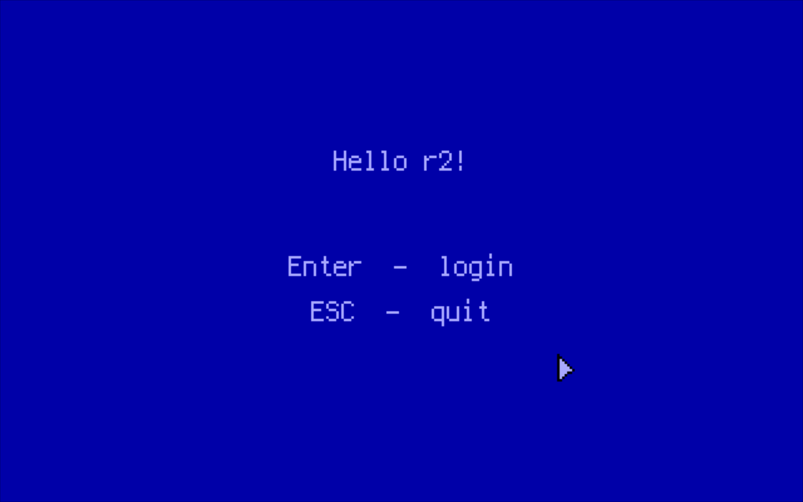
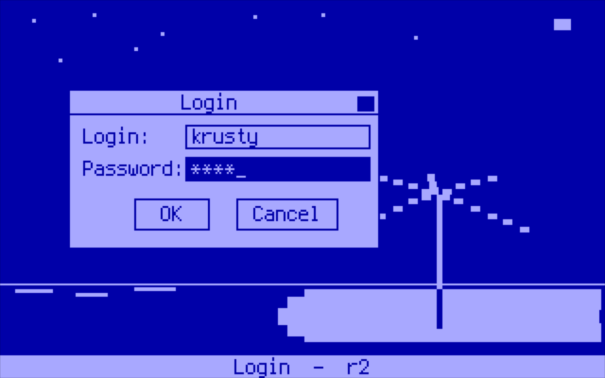
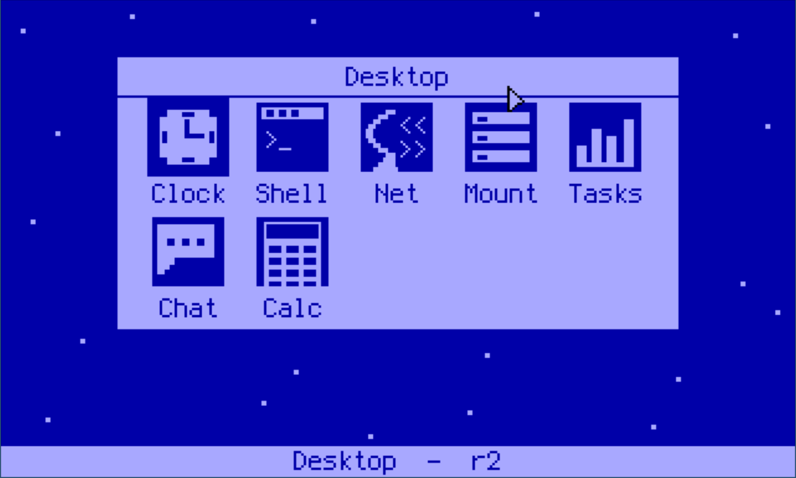
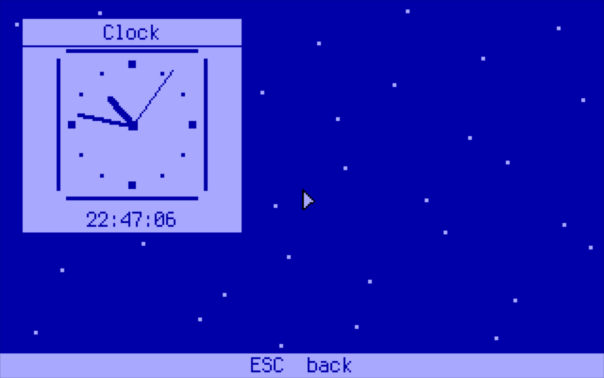

# Memento (GUI)

`MEMENTO.ELF` is a windowed desktop for `r2`. It is built on [Memento](https://github.com/Tarferi/Memento), a small cross-platform UI toolkit, and uses a backend written for this kernel. It is the largest program in the [application suite](apps.md) and the best example of the C++ SDK in real use. It runs a window manager, a mouse cursor, a dozen windows, a TCP/IP client and a TLS-capable web browser, all in one process.

+ [Source (`cpp/memento-hello`)](https://github.com/krustowski/rou2exOS-apps/tree/master/cpp/memento-hello)
+ [Memento toolkit](https://github.com/Tarferi/Memento), with the `r2` backend in `src/ui/platform/impl/r2`



*Fig. 1: The landing screen. Enter (or a click) goes on to the login dialog, and Esc quits back to the shell.*

---

## Running It

`make build_floppy` in the kernel tree puts the program on the floppy as `GFX/MEMENTO.ELF`:

```
cd /mnt/fat/GFX
fg MEMENTO
```

It can also start at boot from `INIT.RC` (see the commented-out lines at the end of `configs/init.rc`).

Some windows need things that live outside the program:

| Needs | For |
|-------|-----|
| A PS/2 mouse | Everything. The cursor is the main way around the desktop. |
| [`ETH`](apps.md#networking) running (`bg eth`) | Net, Chat, IRC and Web |
| `/mnt/iso/opt/memento/cacerts.bin` | HTTPS in the Web window. `make build` in the kernel tree copies it onto the ISO. |
| `tcpp.elf` in `/mnt/iso/bin` | The Editor |
| `sh.elf` in `/mnt/iso/bin` | The Shell icon |
| MIDI files in `/mnt/fat/SOUND` | Music |

When the desktop closes, the program switches the VGA back to text mode and exits to the shell.

---

## The Session

The program goes through three full-screen stages:

1. **Hello**: the landing screen.
2. **Login**: a username and password dialog drawn over the wallpaper.
3. **Desktop**: the launcher. It stays at the bottom of the window stack until it is closed.



*Fig. 2: The login dialog over the wallpaper.*

Everything opened from the desktop is a floating window over it, with a frame, a title bar and an entry on the taskbar along the bottom. **Alt+Tab** cycles through the open windows, and a click on a taskbar entry brings its window to the front, restoring it if it was minimised.



*Fig. 3: The desktop launcher.*

| Icon | Window | What it does | Kernel interface |
|------|--------|--------------|------------------|
| Clock | Clock | Analog clock | RTC, `0x02` |
| Shell | Shell | The userland shell (`sh.elf --host`) as an 80x25 terminal with 200 lines of scrollback (PageUp/PageDown) | spawn `0x2A`, shared user-heap block |
| Net | Network | IP, MAC, driver state and bound TCP ports | `0x38` |
| Mount | Files | Two-pane file manager in the style of Norton Commander: F5 copy and F6 move to the other pane (F6 renames when both show one directory), F7 new folder, F8 delete (a folder only when empty), F3 view, F4 edit. The CD is read-only; copies go a chunk per idle turn with progress shown | `0x2C`, `0x2D`, `0x39`, `0x3A`, `0x22`, `0x23`, `0x27` |
| Tasks | Tasks | Live task table: PID, mode, status, name, RIP; kill by row or typed PID. A **Memory** tab (Tab or M) shows the user heap, each program's frame and heap share, and Memento's own arena | `0x2F`, `0x3B`, `0x3C` |
| Chat | Chat | Client for the [`CHAT`](apps.md#networking) server on TCP/9000 | libcr2 TCP/IP |
| Calc | Calculator | Four-function calculator | none |
| IRC | IRC | IRC client | libcr2 TCP/IP |
| Music | Music | Plays `.MID` files from `/mnt/fat/SOUND` | PIT and speaker ports, `0x30` |
| Web | Web | HTTP/1.1 and HTTPS (TLS 1.2) browser, with no JavaScript or images | Its own TCP/IP, BearSSL |
| Editor | Editor | Turbo C++ 23 (`tcpp.elf`) in a window | spawn `0x2A`, shared user-heap block |
| Snake | Snake | libc++r2's snake example in a window, sharing its rules (`examples/snake/game.hpp`) and its high score (`/mnt/fat/SNAKE.HSC`) | PC speaker beeps, file `0x21` |
| Mines | Minesweeper | Beginner, intermediate and expert boards (1/2/3); a safe first click, flags on the right button or F, chording on open numbers, best times in `/mnt/fat/MINES.HSC` | PC speaker beeps, file `0x21` |

The file manager opens a **File** viewer on the selected file (`0x20`).



*Fig. 4: The Clock window.*

### Notes on individual windows

**Shell** runs `sh.elf` as a process of its own, started with `--host` and the address of a block on the user heap: the shell writes its output into a ring in the block and reads typed characters from another, and the window is the terminal between them (`c/r2sh/host.h` has the layout). Programs the shell starts with `run` print to the console, not the window. `exit`, or the close box, ends the shell; if Memento stops beating, the shell leaves on its own after ten seconds.

**Music** does not use syscall `0x1b`. That call plays a whole song inside the kernel and blocks the caller until it ends, which would freeze the desktop. Instead the window parses the file itself, drives the PIT and speaker ports directly, and plays one step at a time from the idle loop, so the other windows keep running and a song can be stopped.

**Editor** runs as a separate process. `tcpp.elf` is started with `--host` and the address of a block on the user heap. The editor draws its 80×25 screen into that block and reads its keys from it, and the window copies both ways. The editor keeps its own 2 MiB and its own dialog loops, and Memento keeps running beside it. If no window can be created, the editor takes the whole screen instead.

**Web** is described in its engine's [README](https://github.com/krustowski/rou2exOS-apps/tree/master/cpp/memento-hello/web). In short: the browser never blocks, pages are cut at 768 KiB, CSS is limited to what a grid of 16-colour character cells can show, and text is mapped to CP437.

---

## How It Is Put Together

```
main.cpp + windows/*.cpp       the session, the launcher, the windows
      │
Memento platform layer         PlatformWindow, PlatformDrawingContext,
      │                        PlatformBitmap, PlatformFont, ...
r2 backend (impl/r2)           window manager, VGA 640x400x16, mouse, keyboard
      │
libc++r2 + libc++r2compat      runtime, containers, heap, gfx, input, syscalls
      │
libcr2.a (TCP/IP only)         sockets for Chat and IRC
web/ + BearSSL                 the browser engine, its own TCP/IP, and TLS
netmux.cpp                     splits the one frame queue between the two stacks
```

+ **Display.** The backend asks the kernel for mode `0x12` (syscall `0x15`), then reprograms the CRTC to a 640×400 planar mode with the EGA 16-colour palette. Frames are composed in memory and written to the four planes through the VGA window mapped by syscall `0x14`.
+ **Coordinates.** Windows are written in 320×200 units. They are created at 192 DPI, so the backend draws them at twice that resolution, text included.
+ **Networking.** The process has two TCP/IP stacks: libcr2's, for Chat and IRC, and the browser's own. The kernel gives a process a single frame queue (syscall `0x35`), so `netmux.cpp` is the only code that reads it. It sends each frame to the stack that owns the destination port (the browser claims its ports), and holds frames for the other stack until that stack asks for them. ARP goes to both stacks and ping replies go to one. libcr2 receives its frames through `net_set_frame_source()`.
+ **Build flags.** Everything is built freestanding against [libc++r2](libcxxr2.md) in C++17, since Memento is a C++17 codebase. `libcr2.a` is linked last and only for its TCP/IP stack; every symbol both libraries define comes from libc++r2.
+ **Windows.** The window sources are `#include`d into `main.cpp` rather than compiled separately. The Makefile rebuilds `main.o` when any of them changes.

### Memory

The process's private 2 MiB frame at `0x600_000` is full. It holds the code (the browser and BearSSL are most of it), the window manager's frame buffer, the VGA plane staging buffer and a 256 KiB stack. So the heap arena starts small in `.bss` and grows onto the kernel's shared user heap:

```cpp
R2_HEAP_ARENA_GROWING(768 * 1024)   // r2_stubs.cpp
```

The arena starts at 768 KiB in the image. When it is full, it takes further 256 KiB regions from the user heap (syscall `0x0a`). The desktop bitmap alone is 244 KiB and every window has a bitmap of its own, so opening more windows grows the arena instead of failing. The arena does not start on the user heap because the browser keeps page bodies and layout there, about four times the page's size. The user heap is 4 MiB for all processes together, and with a 1 MiB arena already in it, a 700 KiB page no longer fitted.

This only works because the kernel accepts user-heap pointers in syscalls: every pointer argument may lie wholly inside the program image or wholly inside the user heap (see [the specification](../abi/syscall_specification.md)). On older kernels, which accepted pointers only into the image, the program cannot run.

---

## Building

The Makefile expects a checkout of Memento beside the two repositories, at `../../../Memento` from `cpp/memento-hello`.

```
cd cpp/memento-hello
make build      # memento-hello.elf and memento-hello.bin
make install    # copies it onto fat.img as MEMENTO.ELF
make check      # compile-only syntax check of every source
make webtest    # host-side tests of the browser engine
```

| Variable | Default | Meaning |
|----------|---------|---------|
| `MEMENTO` | `../../../Memento` | Memento source tree |
| `LIBCXXR2` | `../libc++r2` | libc++r2, built on demand |
| `LIBCR2` | `../../c/libcr2.a` | libcr2, used for its TCP/IP stack |
| `FLOPPY` | `../../fat.img` | Image for `make install` |
| `STACK_BYTES` | `262144` | Stack size given to `_crt0.asm` |
| `EXTRA` | *(empty)* | Extra compiler flags, e.g. `EXTRA=-DMEMENTO_R2_SERIAL_DEBUG` for backend traces on serial |

The build writes header dependencies (`-MMD -MP`), and they are required. Every `new` of a platform object compiles in that object's size. If a header gains a member and a caller is not rebuilt, the allocation comes out too small and silently corrupts the heap. After changing a header outside this tree, run `make clean`.

---

## Adding a Window

A window is a class with a static event entry point. For example, trimmed from `windows/hello_window.cpp`:

```cpp
class MyWindow
{
public:
    static void onEvent(void *instance, struct PlatformWindowInterfaceInputEvent *data)
    {
        reinterpret_cast<MyWindow *>(instance)->onEvent_(data);
    }

    void SetWindow(PlatformWindow *w) { wnd = w; }

private:
    PlatformWindow *wnd = nullptr;

    void onEvent_(struct PlatformWindowInterfaceInputEvent *data)
    {
        switch (data->type)
        {
        case PlatformWindowInputEventType::OnPaint:
            // data->Data.OnPaint.ctx creates colours and fonts,
            // data->Data.OnPaint.target is the bitmap to draw on
            break;
        case PlatformWindowInputEventType::OnKeyEvent:
            if (data->Data.OnKeyEvent.key->isEscape)
                wnd->Close();
            break;
        default:
            break;
        }
    }
};
```

To add a window to the desktop:

1. Put the class in `windows/` and `#include` it in `main.cpp`, before `desktop_window.cpp`.
2. Add an `AppKind` value and a `case` in `openApp()`. The case creates the window with `g_root->CreateWindow(title, w, h, MyWindow::onEvent, obj, &g_appOpts, deleteMy, obj)`, where `w` and `h` are in 320×200 units. The delete callback frees the object when its window closes.
3. Give the window an icon and a hit-test area in `desktop_window.cpp`.

Every allocation can fail, since there are no exceptions. Check each `new` and each `Create*` call for `nullptr`, as the existing windows do.
