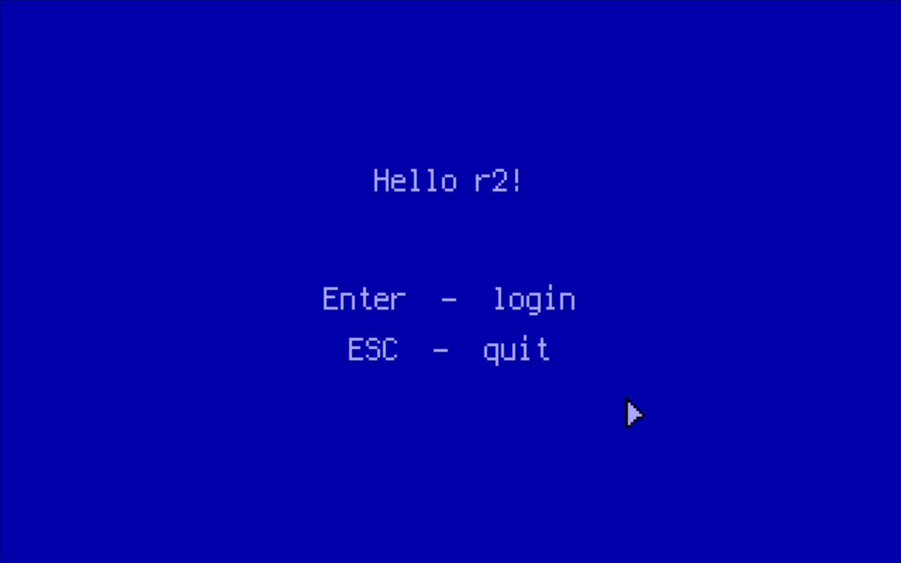
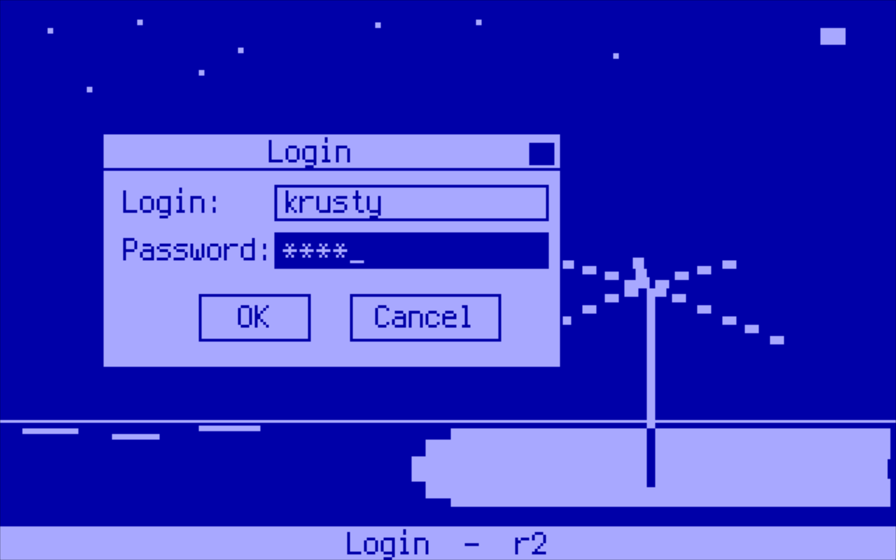
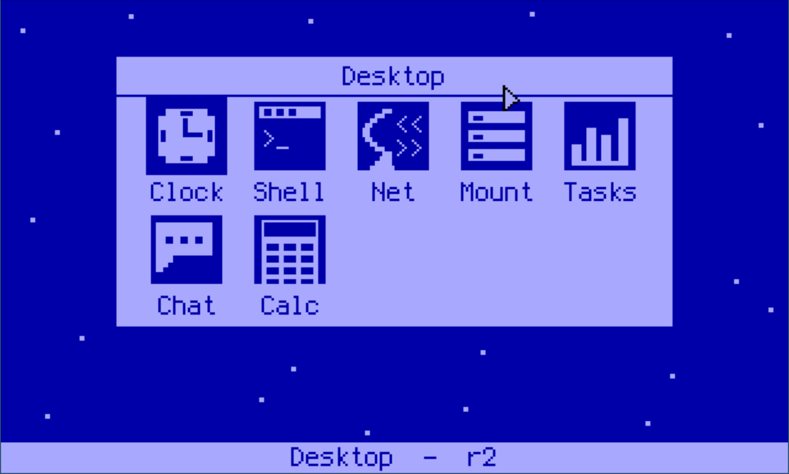
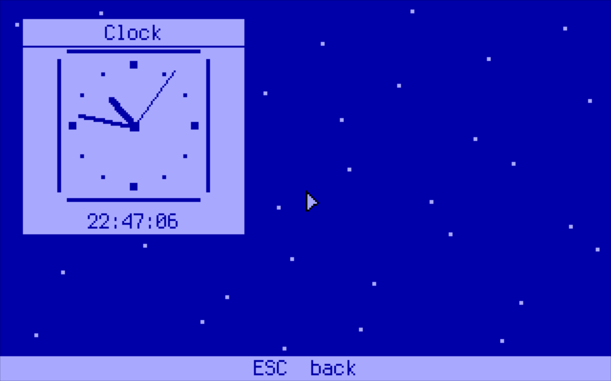

# Memento (GUI)

`MEMENTO.ELF` is a windowed desktop for `r2`. It is built on [Memento](https://github.com/Tarferi/Memento), a small cross-platform UI toolkit, and uses a backend written for this kernel. It is the largest program in the [application suite](apps.md) and the best example of the C++ SDK in real use. It runs a window manager, a mouse cursor, a dozen windows, a TCP/IP client and a TLS-capable web browser with pictures, all in one process, and starts DOS games, films and Turbo C++ as processes of their own in windows beside it.

+ [Source (`cpp/memento-hello`)](https://github.com/krustowski/rou2exOS-apps/tree/master/cpp/memento-hello)
+ [Memento toolkit](https://github.com/Tarferi/Memento), with the `r2` backend in `src/ui/platform/impl/r2`



*Fig. 1: The landing screen. Enter (or a click) goes on to the login dialog, and Esc quits back to the shell.*

---

## Running It

`make build_floppy` in the kernel tree puts the program on the floppy as `GFX/MEMENTO.ELF`:

```
cd /mnt/fat/GFX
fg MEMENTO
```

It can also start at boot from `INIT.RC` (see the commented-out lines at the end of `configs/init.rc`).

Some windows need things that live outside the program:

| Needs | For |
|-------|-----|
| A PS/2 mouse | Everything. The cursor is the main way around the desktop. |
| [`ETH`](apps.md#networking) running (`bg eth`) | Net, Chat, IRC and Web |
| `/mnt/tar/opt/memento/cacerts.bin` | HTTPS in the Web and Telegram windows. `make build` in the kernel tree copies it onto the ISO and into `usb.tar`. |
| `tcpp.elf` in `/mnt/iso/bin` | The Editor |
| `them.elf` in `/mnt/tar/bin` | Running DOS programs from the file manager (the theM window) |
| `mpegplay.elf` in `/mnt/tar/bin`, films in `/mnt/tar/video` | Video |
| A bot token in `/mnt/tar/opt/memento/telegram.txt` (or typed in) | Telegram |
| `/mnt/tmp` (the RAM disk) or a writable floppy | Saving screenshots |
| `sh.elf` in `/mnt/iso/bin` | The Shell icon |
| MIDI files in `/mnt/fat/SOUND` | Music |

Esc on the desktop logs out to the login dialog, and leaving the login dialog restarts the machine (syscall `0x3e`); see [The Session](#the-session). Esc on the landing screen still ends the program, and on the text kernel it switches the VGA back to text mode and returns to the shell.

---

## The Session

The program goes through three full-screen stages:

1. **Hello**: the landing screen.
2. **Login**: a username and password dialog drawn over the wallpaper. Esc, Cancel or its close box restarts the computer (the dialog says so under it); on a kernel without syscall `0x3e` the program ends instead. The first login since boot that gives credentials sets the session's: a salted SHA-256 hash of the pair goes to `/mnt/tmp/SESSION.CFG` (the RAM disk, so it lasts until the next restart), and every later login and unlock has to match it. Until then the system is `root` with no password: empty fields, or `root` with an empty password, log in as that and set nothing, so no `SESSION.CFG` is written, [`TNT`](apps.md) lets a new connection in without asking, and the next login (the lock screen's included) can still give the session its credentials. An accepted login also becomes the system user (syscall `0x01`, `0x03`), so `sysinfo` and the shells' prompts show it; spaces in it become `_`, and an empty login is `root`.
3. **Desktop**: the launcher. It stays at the bottom of the window stack until it is closed. Esc on it (when it has the keyboard: everything minimised, or after Alt+D) locks the session, as Alt+L does from any window. Only when there is no memory for the lock screen does Esc log out instead --- every window closes as its close box would close it, and the login dialog comes back.

The lock screen is the login dialog titled *Locked*, over the whole screen and the taskbar. Every key and click goes to it, the window manager's own keys included, while the windows under it keep running (downloads, chats, music). The session's login and password and Unlock give it back as it was; Esc only clears the fields, and Restart and Power off restart or switch off the computer, which ends the session.



*Fig. 2: The login dialog over the wallpaper.*

Everything opened from the desktop is a floating window over it, with a frame, a title bar and an entry on the taskbar along the bottom; the taskbar's right end has a clock (`hh:mm:ss`, from the RTC). A click on a taskbar entry brings its window to the front, restoring it if it was minimised. The window manager keeps a few keys for itself:

| Keys | What they do |
|------|--------------|
| Alt+Tab | Cycles through the open windows |
| Alt+D | Puts every window away to show the desktop; again brings them back |
| Alt+L | Locks the session (see above) |
| Alt+F | Makes the window in front as large as the screen allows, and back. A window that says it cannot be maximised keeps Alt+F (the Editor, whose Turbo C++ opens its File menu with it) |
| PrintScreen (or Alt+PrintScreen) | Copies the screen, without the pointer, to Memento's clipboard. The taskbar then asks whether to save it as a file too: Y saves it as `SCRnnnnn.PNG` in `/mnt/tmp` (or on the floppy when that will not take it), N or Esc does not |

### The clipboard

One clipboard serves every window: a line of text, or the last screenshot, whichever was put there last. Ctrl+C and Ctrl+V copy and paste text in the Web window (addresses, the find box, form fields) and in Telegram. A screenshot pasted into Telegram is sent as a photo.



*Fig. 3: The desktop launcher.*

| Icon | Window | What it does | Kernel interface |
|------|--------|--------------|------------------|
| Clock | Clock | Analog clock | RTC, `0x02` |
| Shell | Shell | The userland shell (`sh.elf --host`) as an 80x25 terminal with 200 lines of scrollback (PageUp/PageDown) | spawn `0x2A`, shared user-heap block |
| Net | Network | IP, MAC, driver state and the bound TCP ports (up to 16, laid out to the window's width) | `0x38` |
| Mount | Files | Two-pane file manager in the style of Norton Commander. Its top level is the mount list: each mount with its type and size, and on the info line the one under the bar in full (`/mnt/tmp: memdisk, fat16, 126 MiB, 125 MiB free`), read again after anything that changes a disk. F5 copy and F6 move to the other pane (F6 renames when both show one directory), F7 new folder, F8 delete (a folder only when empty), F3 view, F4 edit. Enter on an `.EXE` or `.COM` runs it in theM; Alt+Space, Shift+F10 or a right click opens a menu of the same for the entry under the bar. On a `.PNG` the menu has **Set as wallpaper**: the picture covers the whole screen behind every window (and the login dialog) until Memento ends; `/mnt/tar/pics/warp.png` is one made for it. The CD is read-only; copies go a chunk per idle turn with progress shown | `0x2C`, `0x2D`, `0x39`, `0x3A`, `0x22`, `0x23`, `0x27`, `0x40` |
| Tasks | Tasks | Live task table: PID, mode, status, name, RIP; kill by row or typed PID. A **Memory** tab (Tab or M) shows the user heap, each program's frame and heap share, and Memento's own arena | `0x2F`, `0x3B`, `0x3C` |
| Chat | Chat | Client for the [`CHAT`](apps.md#networking) server on TCP/9000 | libcr2 TCP/IP |
| Calc | Calculator | Four-function calculator | none |
| IRC | IRC | IRC client | libcr2 TCP/IP |
| Music | Music | Plays `.MID` files from `/mnt/fat/SOUND` | PIT and speaker ports, `0x30` |
| Web | Web | HTTP/1.1 and HTTPS (TLS 1.2) browser with pictures (PNG, JPEG, GIF, BMP) and no JavaScript; also opens files from the disks (`/mnt/...` in the address bar) | Its own TCP/IP, BearSSL, stb_image |
| Editor | Editor | Turbo C++ 23 (`tcpp.elf`) in a window | spawn `0x2A`, shared user-heap block |
| Snake | Snake | libc++r2's snake example in a window, sharing its rules (`examples/snake/game.hpp`) and its high score (`/mnt/fat/SNAKE.HSC`) | PC speaker beeps, file `0x21` |
| Mines | Minesweeper | Beginner, intermediate and expert boards (1/2/3); a safe first click, flags on the right button or F, chording on open numbers, best times in `/mnt/fat/MINES.HSC` | PC speaker beeps, file `0x21` |
| Telegram | Telegram | A Telegram bot of your own as a chat client: people who write to the bot are chats on the left, and you answer as the bot. Photos they send are shown; a pasted screenshot goes out as a photo | The browser's TCP/IP and TLS, the Bot API over HTTPS |
| Video | Video | MPEG-1 films from `/mnt/tar/video`, with their MP2 sound through HD Audio, played by `mpegplay.elf` in a process of its own; and HLS streams (an `.m3u8`, a `.url` file, or an address typed with U) of MPEG-1 video and MP2 audio. Up/Down set the volume while one plays | spawn `0x2A`, shared user-heap block, `0x3f` |

The **theM** window has no icon: the file manager opens it, one per program run (see below).

The file manager opens a **File** viewer on the selected file (`0x20`).



*Fig. 4: The Clock window.*

### Notes on individual windows

**Shell** runs `sh.elf` as a process of its own, started with `--host` and the address of a block on the user heap: the shell writes its output into a ring in the block and reads typed characters from another, and the window is the terminal between them (`c/r2sh/host.h` has the layout). Programs the shell starts with `run` print to the console, not the window. `exit`, or the close box, ends the shell; if Memento stops beating, the shell leaves on its own after ten seconds.

**Music** does not use syscall `0x1b`. That call plays a whole song inside the kernel and blocks the caller until it ends, which would freeze the desktop. Instead the window parses the file itself, drives the PIT and speaker ports directly, and plays one step at a time from the idle loop, so the other windows keep running and a song can be stopped.

**Editor** runs as a separate process. `tcpp.elf` is started with `--host` and the address of a block on the user heap. The editor draws its 80×25 screen into that block and reads its keys from it, and the window copies both ways. The editor keeps its own 2 MiB and its own dialog loops, and Memento keeps running beside it. If no window can be created, the editor takes the whole screen instead.

**Web** is described in its engine's [README](https://github.com/krustowski/rou2exOS-apps/tree/master/cpp/memento-hello/web). In short: the browser never blocks, pages are cut at 768 KiB, CSS is limited to what a grid of 16-colour character cells can show, and text is mapped to CP437. Pictures are fetched after the page and its style sheets, the first 16 of a page, and each takes a line of its own in the screen's colours. Ctrl+Space, Shift+F10 or a right click opens a menu (open, open in a new window, copy a link or its text, paste and go, back, reload, find, dark mode); `:img off` turns pictures off. An address answering with a picture shows the picture, and a path (`/mnt/tmp/SCR00001.PNG`) opens a file from a disk.

**Telegram** is a bot's side of the Bot API: `getUpdates` as a long poll, `sendMessage` for what you type, `getFile` and a download for each photo someone sends (the size nearest 320 pixels wide, the last eight kept), and `sendPhoto` for a pasted screenshot, with what is typed as its caption. The token comes from `/mnt/tar/opt/memento/telegram.txt`, or is typed in and kept in `/mnt/fat/TELEGRAM.CFG`.

**Video** decodes the film's MP2 audio in the player (in integers: the player may not touch an SSE register) and plays it through the [HD Audio driver](../audio/hda.md); the sound is then the clock the pictures keep to. For a stream, the window fetches the HLS playlist and its MPEG-TS segments with the browser's loader and hands the bytes to the player through a 1 MiB ring on the user heap; only MPEG-1 video with MP2 audio plays, which is what `ffmpeg -c:v mpeg1video -c:a mp2 -f hls` makes. See the player's [README](https://github.com/krustowski/rou2exOS-apps/tree/master/cpp/mpegplay).

**theM** runs a DOS program in `them.elf`, the emulator, as a process of its own, started with `--host` and a block on the user heap (`c/them/winhost.h`). The emulator then leaves the screen and the keyboard alone: it puts each picture in the block in the screen's colours, text mode included, and takes its keys from the block as the scancodes the keyboard sent. DOS console output goes into the guest's own text screen. The window scales the picture to 4:3 and hands every key on; F12 ends the program, and Enter runs it again once it has ended. The program starts in its own directory, as on DOS.

---

## How It Is Put Together

```
main.cpp + windows/*.cpp       the session, the launcher, the windows
      │
Memento platform layer         PlatformWindow, PlatformDrawingContext,
      │                        PlatformBitmap, PlatformFont, ...
r2 backend (impl/r2)           window manager, VGA 640x400x16, mouse, keyboard
      │
libc++r2 + libc++r2compat      runtime, containers, heap, gfx, input, syscalls
      │
libcr2.a (TCP/IP only)         sockets for Chat and IRC
web/ + BearSSL                 the browser engine, its own TCP/IP, and TLS
netmux.cpp                     splits the one frame queue between the two stacks
```

+ **Display.** On the text kernel the backend asks the kernel for mode `0x12` (syscall `0x15`), then reprograms the CRTC to a 640×400 planar mode with the EGA 16-colour palette. Frames are composed in memory and written to the four planes through the VGA window mapped by syscall `0x14`. On the graphics kernel's framebuffer the screen is as large as the framebuffer and has 256 colours: the same 16, a 6×6×6 cube and 24 greys. Either way a bitmap is one palette index a pixel, which is what the Web, Telegram, Video and theM windows write their pictures into directly.
+ **Coordinates.** Windows are written in 320×200 units. They are created at 192 DPI, so the backend draws them at twice that resolution, text included.
+ **Networking.** The process has two TCP/IP stacks: libcr2's, for Chat and IRC, and the browser's own. The kernel gives a process a single frame queue (syscall `0x35`), so `netmux.cpp` is the only code that reads it. It sends each frame to the stack that owns the destination port (the browser claims its ports), and holds frames for the other stack until that stack asks for them. ARP goes to both stacks and ping replies go to one. libcr2 receives its frames through `net_set_frame_source()`.
+ **Build flags.** Everything is built freestanding against [libc++r2](libcxxr2.md) in C++17, since Memento is a C++17 codebase. `libcr2.a` is linked last and only for its TCP/IP stack; every symbol both libraries define comes from libc++r2.
+ **Windows.** The window sources are `#include`d into `main.cpp` rather than compiled separately. The Makefile rebuilds `main.o` when any of them changes.

### Memory

The process's private 2 MiB frame at `0x600_000` is full. It holds the code (the browser and BearSSL are most of it), the window manager's frame buffer, the VGA plane staging buffer and a 256 KiB stack. So the heap arena starts small in `.bss` and grows onto the kernel's shared user heap:

```cpp
R2_HEAP_ARENA_GROWING(768 * 1024)   // r2_stubs.cpp
```

The arena starts at 768 KiB in the image. When it is full, it takes further 256 KiB regions from the user heap (syscall `0x0a`). The desktop bitmap alone is 244 KiB and every window has a bitmap of its own, so opening more windows grows the arena instead of failing. The arena does not start on the user heap because the browser keeps page bodies and layout there, about four times the page's size. The user heap is 4 MiB for all processes together until it is full; then the kernel grows it once by an eighth of the RAM (see [`0x0a`](../abi/syscalls/sysinfo_mem_mgmt.md#0x0a-allocate-memory-on-heap)), which is where decoded pictures, the theM window's 600 KiB block and screenshots find their room.

The image itself is close to full: code, data and `.bss` come to about 2 MiB less 85 KiB. Anything large belongs on the heap.

This only works because the kernel accepts user-heap pointers in syscalls: every pointer argument may lie wholly inside the program image or wholly inside the user heap (see [the specification](../abi/syscall_specification.md)). On older kernels, which accepted pointers only into the image, the program cannot run.

---

## Building

The Makefile expects a checkout of Memento beside the two repositories, at `../../../Memento` from `cpp/memento-hello`.

```
cd cpp/memento-hello
make build      # memento-hello.elf and memento-hello.bin
make install    # copies it onto fat.img as MEMENTO.ELF
make check      # compile-only syntax check of every source
make webtest    # host-side tests of the browser engine
```

| Variable | Default | Meaning |
|----------|---------|---------|
| `MEMENTO` | `../../../Memento` | Memento source tree |
| `LIBCXXR2` | `../libc++r2` | libc++r2, built on demand |
| `LIBCR2` | `../../c/libcr2.a` | libcr2, used for its TCP/IP stack |
| `FLOPPY` | `../../fat.img` | Image for `make install` |
| `STACK_BYTES` | `262144` | Stack size given to `_crt0.asm` |
| `EXTRA` | *(empty)* | Extra compiler flags, e.g. `EXTRA=-DMEMENTO_R2_SERIAL_DEBUG` for backend traces on serial |

The build writes header dependencies (`-MMD -MP`), and they are required. Every `new` of a platform object compiles in that object's size. If a header gains a member and a caller is not rebuilt, the allocation comes out too small and silently corrupts the heap. After changing a header outside this tree, run `make clean`.

---

## Adding a Window

A window is a class with a static event entry point. For example, trimmed from `windows/hello_window.cpp`:

```cpp
class MyWindow
{
public:
    static void onEvent(void *instance, struct PlatformWindowInterfaceInputEvent *data)
    {
        reinterpret_cast<MyWindow *>(instance)->onEvent_(data);
    }

    void SetWindow(PlatformWindow *w) { wnd = w; }

private:
    PlatformWindow *wnd = nullptr;

    void onEvent_(struct PlatformWindowInterfaceInputEvent *data)
    {
        switch (data->type)
        {
        case PlatformWindowInputEventType::OnPaint:
            // data->Data.OnPaint.ctx creates colours and fonts,
            // data->Data.OnPaint.target is the bitmap to draw on
            break;
        case PlatformWindowInputEventType::OnKeyEvent:
            if (data->Data.OnKeyEvent.key->isEscape)
                wnd->Close();
            break;
        default:
            break;
        }
    }
};
```

To add a window to the desktop:

1. Put the class in `windows/` and `#include` it in `main.cpp`, before `desktop_window.cpp`.
2. Add an `AppKind` value and a `case` in `openApp()`. The case creates the window with `g_root->CreateWindow(title, w, h, MyWindow::onEvent, obj, &g_appOpts, deleteMy, obj)`, where `w` and `h` are in 320×200 units. The delete callback frees the object when its window closes.
3. Give the window an icon and a hit-test area in `desktop_window.cpp`.

Every allocation can fail, since there are no exceptions. Check each `new` and each `Create*` call for `nullptr`, as the existing windows do.

A window that writes pixels straight into its bitmap (`R2_BitmapImpl::GetPixels()`, one palette index a pixel, rows `GetRealWidth()` apart), as the picture windows do, takes the pixels a unit from the DPI: `wnd->GetEffectiveDPI() / 96.0`. Not from the bitmap's width over the window's: Memento allocates bitmaps in steps of 150 pixels, so a bitmap is often wider than its window, and a scale worked out that way puts everything too far right and down.
